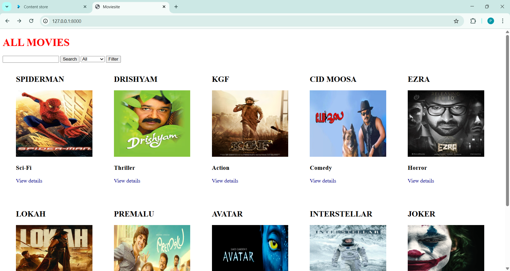

# Django Movie Website

A web application built using Django that manages movie information with basic CRUD functionality. This project demonstrates backend development using Django, templates and database integration.

## Features
- Add, update, delete, and view movies by users
- Django admin panel integration
- User-friendly interface using HTML & CSS
- Database integration (SQLite)

## Output Preview

